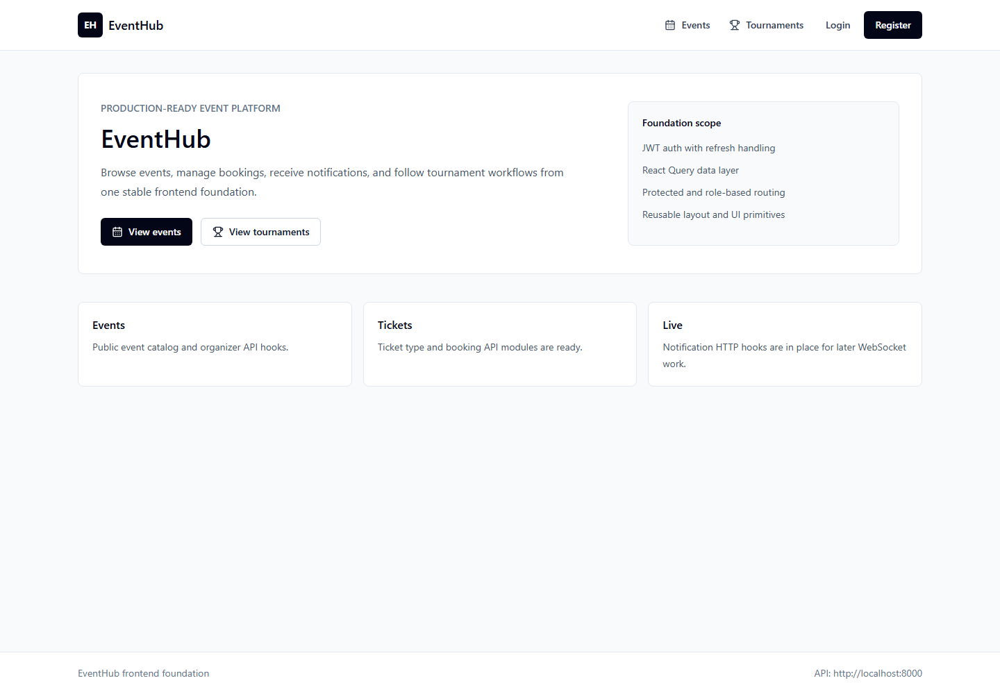
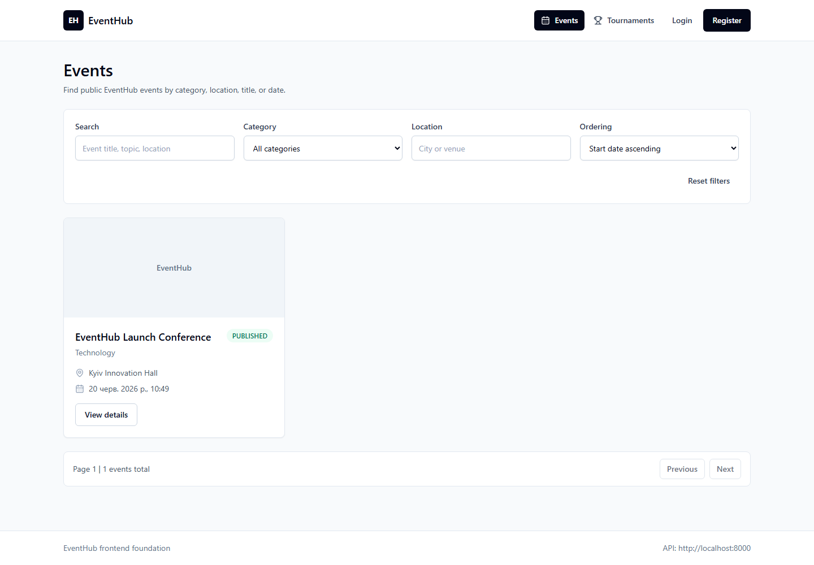
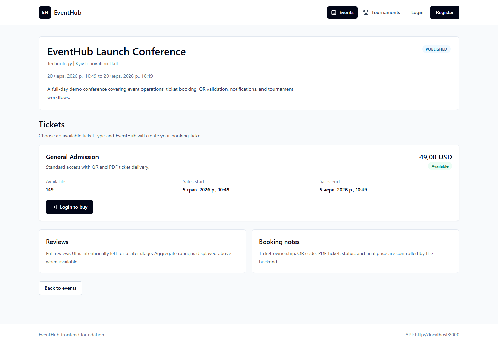
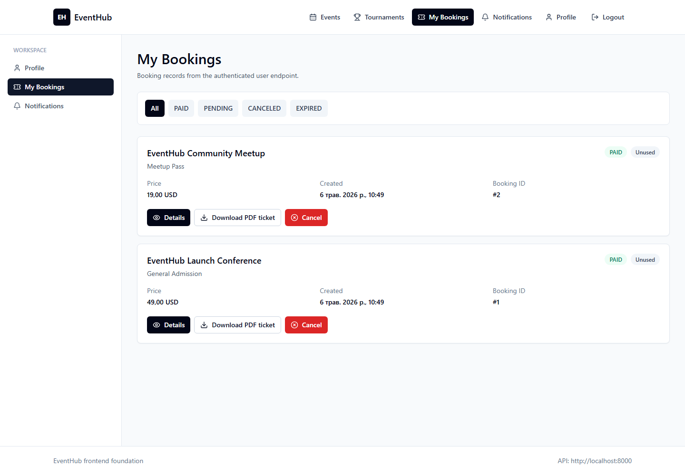
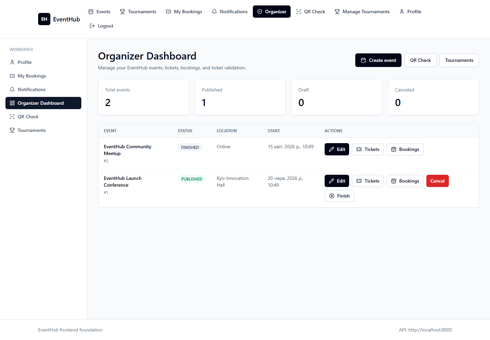
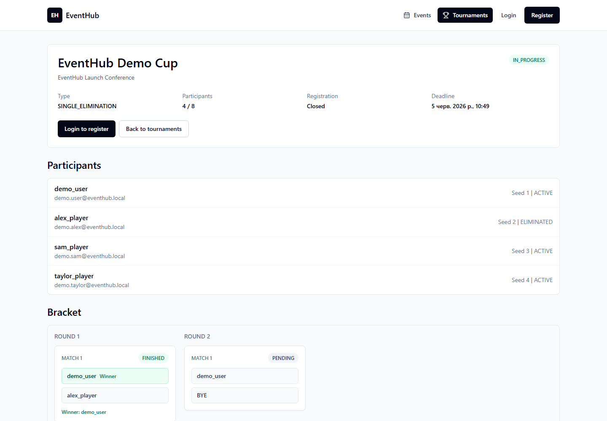
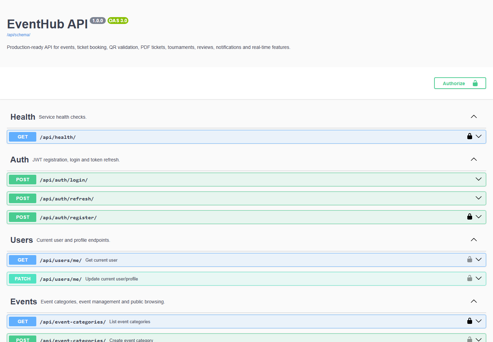

# EventHub

[](#tech-stack)
[](#api-documentation)
[](#tech-stack)
[](#tech-stack)
[](#tech-stack)
[](#run-with-docker)
[](#testing)

EventHub is a production-ready full-stack platform for event management, ticket booking, QR/PDF tickets, tournaments, reviews, notifications and real-time updates.

## Features

Backend:

- Custom User model with email login.
- JWT authentication with refresh tokens.
- Role-based permissions: USER / ORGANIZER / ADMIN.
- Event management.
- Ticket types with availability validation.
- Atomic ticket booking with `transaction.atomic` and `select_for_update`.
- Overselling protection.
- QR ticket generation and organizer validation.
- PDF ticket generation and secure download.
- Persistent notifications.
- WebSocket live notifications.
- Audit logs with request id, IP and user-agent.
- Redis caching for public event data.
- Celery background tasks.
- Single-elimination tournament engine.
- Match result submission and winner promotion.
- Reviews with average rating via ORM annotations.
- Swagger/OpenAPI documentation.
- Django Admin dashboard.
- pytest, factory_boy and coverage.

Frontend:

- React + Vite.
- Tailwind UI.
- Axios client with JWT refresh.
- React Query.
- Protected and role-based routes.
- Events browsing and filters.
- Event details and ticket purchase.
- My bookings and PDF ticket download.
- QR display.
- Organizer dashboard.
- Event and ticket management.
- Booking validation page.
- Tournament bracket visualization.
- Match result form.
- WebSocket-driven refresh.

## Tech Stack

Backend:

- Python.
- Django.
- Django REST Framework.
- PostgreSQL.
- Redis.
- Celery.
- Django Channels.
- SimpleJWT.
- drf-spectacular.
- pytest.
- factory_boy.

Frontend:

- React.
- Vite.
- Tailwind CSS.
- Axios.
- React Query.
- React Router.

Infrastructure:

- Docker.
- Docker Compose.
- Nginx/Gunicorn deployment-ready notes.

## Architecture

```text
backend/
  apps/
    users/
    events/
    tickets/
    bookings/
    tournaments/
    reviews/
    notifications/
    audit/
    common/
  config/

frontend/
  src/
    api/
    app/
    components/
    hooks/
    pages/
    router/
    store/
    utils/
```

EventHub keeps business rules in backend service-layer modules, exposes them through a DRF API layer, persists state in PostgreSQL, and uses Redis for cache, Celery broker/result storage and Channels transport. Celery handles asynchronous work such as emails, reminders, expiration and cleanup. Django Channels powers authenticated WebSocket notifications. The React client uses Axios, React Query and route guards to consume the API and refresh user-facing data from live notification events.

More details: [docs/architecture.md](docs/architecture.md).

## Core Business Flows

Ticket booking:

1. User selects ticket type.
2. Backend locks `TicketType` with `select_for_update`.
3. Booking is created atomically.
4. `sold_count` is updated safely.
5. QR and PDF are generated.
6. Email, notification and realtime events are triggered after commit.

Ticket validation:

1. Organizer opens validation page.
2. Booking ID or QR data is checked.
3. Backend validates permission and booking status.
4. Ticket becomes used.
5. Repeated use is rejected.

Tournament:

1. Organizer creates tournament.
2. Registration opens.
3. Users register.
4. Organizer starts tournament.
5. Backend generates single-elimination bracket.
6. Organizer submits match results.
7. Winners are promoted through `next_match` and `next_match_slot`.
8. Final result finishes tournament.

## API Documentation

- Swagger UI: <http://localhost:8000/api/docs/>
- ReDoc: <http://localhost:8000/api/redoc/>
- OpenAPI schema: <http://localhost:8000/api/schema/>

Important endpoints:

Auth:

- `POST /api/auth/register/`
- `POST /api/auth/login/`
- `POST /api/auth/refresh/`
- `GET /api/users/me/`

Events:

- `GET /api/events/`
- `POST /api/events/`
- `POST /api/events/{id}/publish/`
- `POST /api/events/{id}/cancel/`
- `GET /api/events/popular/`

Tickets/Bookings:

- `GET /api/events/{event_id}/tickets/`
- `POST /api/bookings/`
- `GET /api/bookings/my/`
- `POST /api/bookings/{id}/cancel/`
- `POST /api/bookings/{id}/use/`
- `GET /api/bookings/{id}/download-pdf/`

Tournaments:

- `GET /api/tournaments/`
- `POST /api/tournaments/{id}/register/`
- `POST /api/tournaments/{id}/start/`
- `GET /api/tournaments/{id}/bracket/`
- `POST /api/matches/{id}/result/`

Reviews:

- `GET /api/events/{event_id}/reviews/`
- `POST /api/events/{event_id}/reviews/`

Notifications:

- `GET /api/notifications/`
- `POST /api/notifications/{id}/read/`
- `POST /api/notifications/read-all/`

WebSocket:

- `ws://localhost:8000/ws/notifications/?token=<access_token>`

## Screenshots

| Home | Events |
| --- | --- |
|  |  |

| Event Details | My Bookings |
| --- | --- |
|  |  |

| Organizer Dashboard | Tournament Bracket |
| --- | --- |
|  |  |

| Swagger API Docs |
| --- |
|  |

## Environment Variables

Environment examples:

- Backend: [backend/.env.example](backend/.env.example)
- Frontend: [frontend/.env.example](frontend/.env.example)

Do not commit real `.env` files. Keep production secrets in environment-specific secret storage.

## Run with Docker

Create local environment files:

```bash
cp backend/.env.example backend/.env
cp frontend/.env.example frontend/.env
```

Start the stack:

```bash
docker compose up --build
```

Run migrations:

```bash
docker compose exec backend python manage.py migrate
```

Seed local demo data for portfolio screenshots:

```bash
docker compose exec backend python manage.py seed_demo
```

Demo credentials:

```text
Organizer: demo.organizer@eventhub.local / EventHubDemo123!
User: demo.user@eventhub.local / EventHubDemo123!
```

Create a superuser:

```bash
docker compose exec backend python manage.py createsuperuser
```

Run tests:

```bash
docker compose exec backend python manage.py test
docker compose exec backend pytest
```

API docs:

```text
http://localhost:8000/api/docs/
```

Frontend:

```text
http://localhost:5173
```

## Local Development

Backend:

```bash
cd backend
python -m venv .venv
source .venv/bin/activate
pip install -r requirements.txt
python manage.py migrate
python manage.py runserver
```

Windows PowerShell activation:

```powershell
cd backend
python -m venv .venv
.\.venv\Scripts\Activate.ps1
pip install -r requirements.txt
python manage.py migrate
python manage.py runserver
```

Frontend:

```bash
cd frontend
npm install
npm run dev
```

## Testing

Backend checks:

```bash
cd backend
python manage.py makemigrations --check
python manage.py check
python manage.py test
pytest
pytest --cov=apps --cov=config --cov-report=term-missing
```

Docker backend checks:

```bash
docker compose exec backend python manage.py makemigrations --check
docker compose exec backend python manage.py check
docker compose exec backend python manage.py test
docker compose exec backend pytest
```

Frontend checks:

```bash
cd frontend
npm run build
```

Docker frontend check:

```bash
docker compose exec frontend npm run build
```

Optional backend linting/formatting:

```bash
cd backend
pip install -r requirements-dev.txt
black --check .
isort --check-only .
ruff check .
```

## Deployment

Deployment notes are documented in [docs/deployment.md](docs/deployment.md).

Production checklist summary:

- Set `DEBUG=False`.
- Use a strong `SECRET_KEY`.
- Set explicit `ALLOWED_HOSTS`.
- Configure HTTPS and a real reverse proxy, for example Nginx.
- Run backend through Gunicorn or Daphne/ASGI depending on WebSocket deployment needs.
- Run Celery worker and Celery Beat as separate processes.
- Use persistent PostgreSQL, Redis and media/static storage.
- Configure real email delivery.
- Add backup, monitoring and log aggregation for real deployments.

## Security Notes

- Secrets are loaded through environment variables.
- JWT authentication protects private API routes.
- Object-level permissions protect user-owned resources.
- Role-based frontend routing limits organizer/admin screens.
- Atomic booking prevents race-condition overselling.
- QR tickets are protected against repeated use.
- AuditLog records important business actions.
- Request id middleware improves traceability.
- PDF tickets are served through protected media endpoints.
- `.env` files are excluded from git.
- Users cannot self-validate tickets.
- Owners can download PDF tickets but cannot use tickets as organizers.

See [SECURITY.md](SECURITY.md) for the concise security policy.

## Known Limitations

- No real payment provider yet.
- QR camera scanner is not implemented; manual booking ID validation is available.
- Frontend admin panel is limited to organizer flows.
- No custom tournament room WebSocket; notifications WebSocket is used for refresh.
- Deployment config is Docker Compose-ready, but production cloud deployment still requires environment-specific setup.

## Resume Highlights

- Atomic booking with `select_for_update`.
- QR/PDF ticketing.
- Celery + Redis.
- Channels WebSocket.
- Tournament bracket engine.
- OpenAPI docs.
- pytest + coverage.
- Dockerized architecture.

## Commands Checklist

Backend:

```bash
docker compose exec backend python manage.py makemigrations --check
docker compose exec backend python manage.py check
docker compose exec backend python manage.py test
docker compose exec backend pytest
```

Frontend:

```bash
docker compose exec frontend npm run build
```

Local frontend alternative:

```bash
cd frontend && npm run build
```
